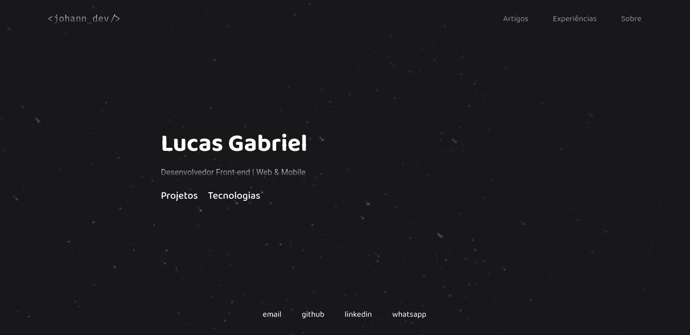

<h1 align="center">
  Lucas Johann
</h1>

  

 

  Bem vindo ao meu portfólio de desenvolvedor Front-end

## Tecnologias utilizadas

<a href="https://pt-br.legacy.reactjs.org/">React.JS</a>
| 
<a href="https://www.typescriptlang.org/">TypeScript</a>
|
<a href="https://tailwindcss.com/">Tailwind CSS</a>

## Seções

__Artigos__: lista de artigos que já publiquei;

__Experiências__: apresento minha trajetória profissional listando as empresas, período em que prestei serviço e a área em que atuei;

__Projetos__: apresenta os principais projetos que já desenvolvi;

__Tecnologias__: exibe as tecnologias que tenho domínio e/ou conhecimento prévio;

__Sobre__: uma breve apresentação sobre a minha pessoa;

---

 

<footer>
  
Feito com 💜 by Lucas

</footer>